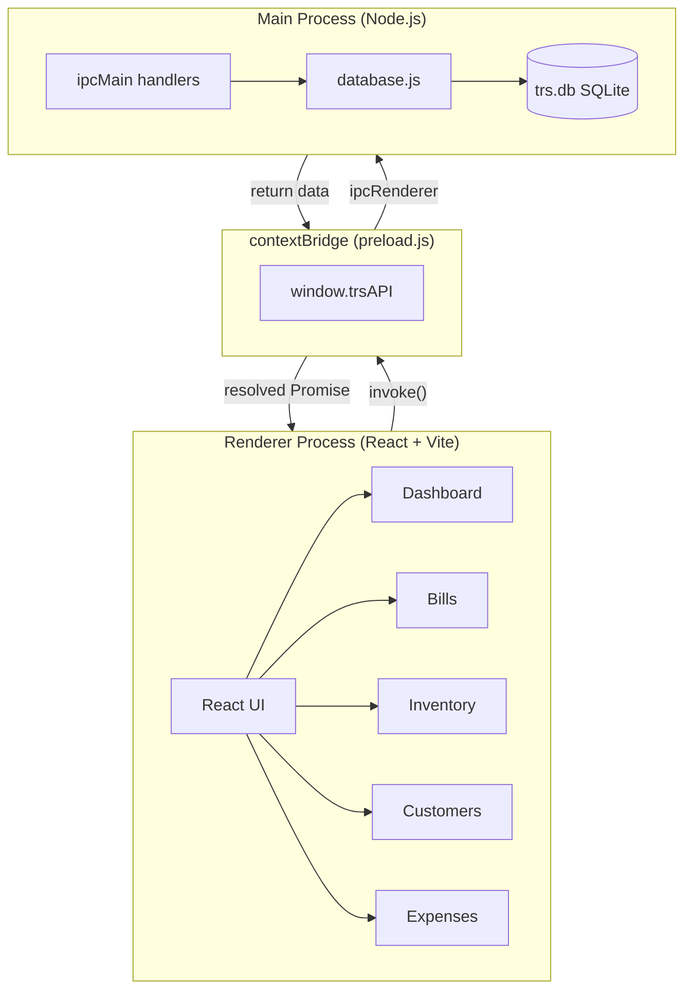

<div align="center">

# Profit Pilot

**Offline-first business intelligence & billing desktop application**

[](https://www.electronjs.org/)
[](https://react.dev/)
[](https://github.com/WiseLibs/better-sqlite3)
[](https://vitejs.dev/)
[](https://www.microsoft.com/windows)
[](.)

> Built for **TRS Travel and Tours Pvt. Ltd.** — a Japanese import & distribution company  
> Replaces spreadsheets with a fast, fully offline desktop ERP for sales tracking, invoicing, and profit analysis.

</div>

---

## What It Does

Profit Pilot is a **single-file desktop application** that gives a small business real-time visibility into its numbers — without internet, without subscriptions, without complexity. Everything lives in one SQLite file on the user's machine.

The core focus is **data** — every sale, every expense, every product is queryable and visualized. Billing is the primary data-entry mechanism; the dashboard turns that data into actionable insights.

---

## Key Features

### Analytics & Dashboard
- **Monthly KPI strip** — Revenue, Cost of Goods, Gross Profit, Expenses, Net Profit for the current month
- **6-month Revenue vs Expenses bar chart** — spot trends at a glance
- **Top 5 Products by Revenue** — ranked with progress bars
- **Top 5 Customers by Sales** and **Top 5 Customers by Gross Profit** — side by side
- **Top 5 Expense Categories** — see where money is going
- **Real-time Outstanding balance** — total unpaid across all customers
- **Low Stock Alert** — products below threshold, color-coded by severity

### Billing & Invoicing
- Create professional tax invoices (TAX INVOICE format)
- Auto-carries forward unpaid previous balances into new bills
- Rolled-forward bills clearly marked — no double-counting in analytics
- Record partial payments with running balance
- Print-ready invoice view (Sub Total / Previous Due / Grand Total breakdown)
- Bill status: Paid / Partial / Outstanding / Carried Forward
- Date filter and search across all bills

### Inventory Management
- Add/edit products with cost price and stock quantity
- Stock automatically decremented on each sale
- Stock validation at bill creation (cannot oversell)
- Low stock threshold alerts on dashboard

### Customer Management
- Customer profiles with address, phone, email, notes
- Opening balance support (pre-existing debt migration)
- Per-customer outstanding balance calculated live from bills
- Total outstanding across all customers

### Expense Tracking
- 7 predefined categories (Container Parking, Road Tax, Delivery, Petrol, Salary, Maintenance, Miscellaneous)
- Monthly view with category breakdown
- Flows directly into net profit calculation on dashboard

---

## Architecture



### Data Flow

```
User Action (React)
  → window.trsAPI.createBill(data, items)       [preload.js contextBridge]
  → ipcRenderer.invoke('create-bill', ...)       [IPC channel]
  → ipcMain.handle('create-bill', ...)           [main.js]
  → db.createBill(data, items)                   [database.js]
  → SQLite transaction (insert bill + items,     [trs.db]
     adjust stock, mark rolled_forward,
     apply payment)
  → returns billId → Promise resolves → UI updates
```

### Key Architectural Decisions

| Decision | Reason |
|----------|--------|
| SQLite over cloud DB | 100% offline, zero config, single file = easy backup |
| better-sqlite3 (sync) | Simpler transaction handling, no async DB code in main process |
| grand_total stores sub_total + previous_due | Correct outstanding math — one source of truth per bill |
| rolled_forward flag | Prevents double-counting when debt is consolidated into new bill |
| bill_items JOIN for analytics | Uses actual line-item data, never inflated grand_total |
| Vite base: './' | Required for Electron to load bundled HTML from filesystem |

---

## Project Structure

```
profit-pilot/
│
├── main.js              # Electron main process — window, IPC handlers
├── preload.js           # contextBridge — exposes trsAPI to renderer
├── database.js          # All SQLite queries, migrations, business logic
│
├── package.json         # Scripts, electron-builder config
├── vite.config.js       # React/Vite build config
├── index.html           # HTML shell
│
└── src/
    ├── main.jsx         # React entry point
    ├── App.jsx          # Shell layout: sidebar + topbar + routing
    ├── index.css        # Design system — CSS variables, components
    │
    └── pages/
        ├── Dashboard.jsx    # KPIs, charts, rankings
        ├── Bills.jsx        # Bill list, payment recording, invoice print
        ├── NewBill.jsx      # Bill creation with live outstanding lookup
        ├── Inventory.jsx    # Product CRUD + stock management
        ├── Customers.jsx    # Customer CRUD + opening balance
        └── Expenses.jsx     # Expense CRUD + monthly breakdown
```

---

## Database Schema

```sql
products     — id, name, unit, cost_price, sell_price, stock
bills        — id, bill_number, customer_name, sub_total, grand_total,
               amount_paid, paid, previous_due, rolled_forward, bill_type, created_at
bill_items   — id, bill_id, product_id, product_name, quantity, unit_price, total
customers    — id, name, address, phone, email, notes, opening_balance
expenses     — id, category, amount, note, date
```

**`rolled_forward`** — set to `1` on old bills when a newer bill absorbs their outstanding debt via `previous_due`. Excluded from all outstanding calculations to prevent double-counting.

---

## Tech Stack

| Layer | Technology | Why |
|-------|-----------|-----|
| Desktop shell | Electron 41 | Cross-platform, ships Chromium + Node |
| UI framework | React 19 + Vite 8 | Fast dev, small bundle |
| Database | SQLite via better-sqlite3 | Offline, zero-config, single file |
| Charts | Recharts | Composable, React-native charts |
| Packaging | electron-builder | One-command Windows installer |
| Styling | Vanilla CSS (custom design system) | No dependencies, full control |

---

## Getting Started (Development)

### Prerequisites
- [Node.js LTS](https://nodejs.org) (v18+)
- Windows (primary target), macOS/Linux work for development

### Install & Run

```bash
# Clone the repo
git clone https://github.com/YOUR_USERNAME/profit-pilot.git
cd profit-pilot

# Install dependencies (compiles better-sqlite3 native module)
npm install

# Start in development mode
npm run dev
```

This starts the Vite dev server on `localhost:5173` and opens the Electron window automatically.

### Build Windows Installer

```bash
npm run dist
```

Output: `release/TRS Business Manager Setup 1.0.0.exe` (~100 MB)

The installer:
- Requires no runtime (Node.js, etc.) on the target machine
- Creates `trs.db` next to the `.exe` on first launch
- Creates a desktop shortcut

> **Install location tip:** Do not install to `C:\Program Files\` — choose `C:\TRS Business Manager\` or similar to avoid Windows write-permission issues on the database file.

---

## Updating the App

Currently updates are manual:
1. Make changes in the codebase
2. Run `npm run dist` to build a new installer
3. Send the new `.exe` to the client
4. They run it — installs over the existing version
5. **`trs.db` is untouched** — all their data is preserved

> Auto-update via `electron-updater` + GitHub Releases can be added in a future version.

---

## Client

**TRS Travel and Tours Pvt. Ltd.**
Import & distribution business based in Chiba, Japan.
Uses this app to manage product inventory, generate customer invoices in JPY, and track monthly profitability across product lines.

---

## Common Issues

**`npm install` fails on `better-sqlite3`**
```bash
npm install --build-from-source
# May need: https://aka.ms/vs/17/release/vs_BuildTools.exe
```

**App window is blank after `npm run dev`**
- Open the **Electron window**, not the browser at `localhost:5173`
- `window.trsAPI` only exists inside Electron (injected by preload.js)

**Chart shows "No data yet" but KPIs show values**
- Was a timezone bug (UTC vs local time) — fixed in current version

---

<div align="center">

Built with Electron · React · SQLite

</div>
